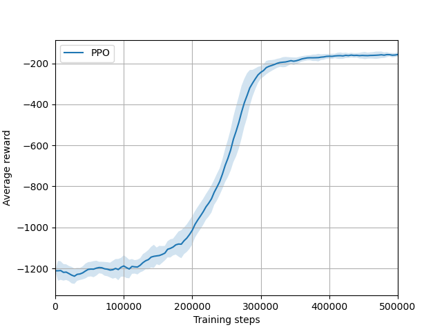

# Playground for stable-baselines and CALF

Description of CALF (Critic as Lyapunov Function) can be found in [this paper](https://arxiv.org/abs/2405.18118).

It's better to work in a virtual environment.
The instructions are similar to those in [regelum-playground](https://github.com/osinenkop/regelum-playground).

Don't forget to install `tkinter`.

We got the follosing results by runing our code on ten different seeds [1, 2, 3, 4, 5, 6, 7, 8, 9, 0]



To get the same results you have to run the following command:

```shell
python3 Pendulum_PPO.py 
```

This will run on 
