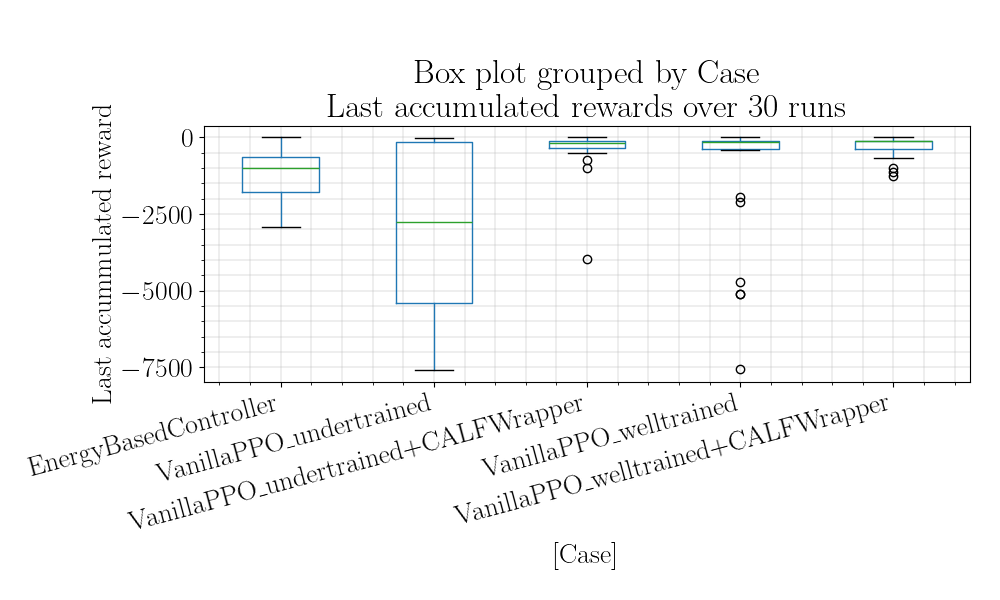

# Stable Baselines Playground with CALF and Visual PPO


This repository is a playground for reinforcement learning using [stable-baselines3](https://github.com/DLR-RM/stable-baselines3).
It extends classic environments like Gym's Pendulum with visual observations.

## Overview

### Visual PPO with CNNs
This repository also includes an extension of PPO (Proximal Policy Optimization) to visual environments. It leverages custom Convolutional Neural Networks (CNNs) to process image-based observations and enables effective policy learning with stacked frames.

### CALF (Critic as Lyapunov Function)
CALF provides a method to stabilize reinforcement learning using Lyapunov theory. For more details, refer to [this paper](https://arxiv.org/abs/2405.18118).

This feature is in development for this repository.

---

## Setting Up the Environment

To work with this repository, it is recommended to use a virtual environment. Refer to the instructions in the [regelum-playground](https://github.com/osinenkop/regelum-playground) for detailed steps.

Make sure to install the required dependencies, including `tkinter` for visualizations:

```bash
pip install -e .
```

Some issues you may find their solution [here](docs/error_resolution.md).

## Running the Scripts

### Train and Evaluate PPO (Pendulum Environment)

#### Training

To train a PPO agent on the standard pendulum environment:

```bash
python run/ppo_pendulum_calf_wrapper_eval/pendulum_ppo.py
```

To train an agent on the visual pendulum environment using stacked image frames:
    
```bash
python run/ppo_vispendulum_self_boost/pendulum_visual_ppo.py
```

#### Evaluation
After training, evaluate the agent with (example command):

```bash
python run/ppo_vispendulum_self_boost/pendulum_visual_ppo.py --notrain
```

A successfully pre-trained agent can be found [here](./workable_visual_PPO4pendulum.zip).
It was run using the following command:

```bash
 python run/ppo_vispendulum_self_boost/pendulum_visual_ppo.py --normalize
```

The following configuration was used:

```python
total_timesteps = 131072
episode_timesteps = 1024
image_height = 64
image_width = 64
n_steps = 1024
parallel_envs = 8

# Hyperparameters for PPO
ppo_hyperparams = {
    "learning_rate": 4e-4,
    "n_steps": n_steps,
    "batch_size": 512,
    "gamma": 0.99,
    "gae_lambda": 0.9,
    "clip_range": 0.2,
}
```

... and 4 stacked frames.

## Options

Option | Description |
| ----- |  ----- |
| `--notrain` | Skip training and only run evaluation |
| `--console` | Run in console-only mode (no graphical outputs) |
| `--normalize` | Normalize reward for stable learning |
| `--single-thread` | Use a single-threaded environment for training |

### Test a CNN for Visual Pendulum

To visualize and save the CNN feature maps for the visual pendulum:

```bash
python -m scripts.test_visual_pendulum_cnn_stacked
```

#### Options for Testing CNN.

Option | Description |
| ----- |  ----- |
| `--model` | Path to a trained model (e.g., checkpoints/model.zip) |

This script simulates the environment and saves the extracted CNN feature maps, which can be used to evaluate the model's understanding of the environment.

#### Tested CNN Architecture

The custom CNN architecture used in this repository for visual PPO is as follows:

**Convolutional Layers**:

1. 32 filters, 8x8 kernel, stride 4
1. 64 filters, 4x4 kernel, stride 2
1. 64 filters, 3x3 kernel, stride 1

**Fully Connected Layer**:
256 neurons for feature extraction

**Output**:

Processes stacked input frames (e.g., 4 frames) for policy learning.
[Here](./gfx/CNN_architecture_PPO4Pendulum.png) is a graphical representation of the CNN architecture.

### Train PPO and Evaluate PPO (Pendulum Environment) with CALF Wrapper
#### Training
PPO is trained using as mentioned above with the standard pendulum environment:
```bash
python run/ppo_pendulum_calf_wrapper_eval/pendulum_ppo.py
```

The following configuration was used:

```
ppo_hyperparams = {
        "learning_rate": 5e-4,
        "n_steps": 4000,
        "batch_size": 200,
        "gamma": 0.98,
        "gae_lambda": 0.9,
        "clip_range": 0.05,
        "learning_rate": get_linear_fn(5e-4, 1e-6, total_timesteps*2),
        "use_sde": True,
        "sde_sample_freq": 4,
    }
```

#### Evaluation scripts
To evaluate vanilla PPO with and without CALF wrapper (using Pendulum environment), there are 5 evaluation scenario should be run:
- Welled-trained vanilla PPO is evaluated with standard Pedulum environment
- Under-trained vanilla PPO is evaluated with standard Pedulum environment
- Welled-trained vanilla PPO is evaluated with standard Pedulum environment + CALF Wrapper
- Under-trained vanilla PPO is evaluated with standard Pedulum environment + CALF Wrapper
- Traditional controller algorithm (as a reference, and used as CALF fallback controller as well) is evaluated
  
Use this pre-defined script:
```shell
source run/ppo_pendulum_calf_wrapper_eval/evaluation.sh
```
Or to run 30 seeds for each case with corresponding initial states:
```shell
source run/ppo_pendulum_calf_wrapper_eval/evaluation_loop.sh
```

#### Options

Option | Description |
| ----- |  ----- |
| `--notrain` | Skip training and only run evaluation |
| `--seed` | Random seed to initialize initial state of the pendulum |
| `--loadstep` | Choose the checkpoint step want to load in the evaluation phase (i.e. 200000, 201000 500000) |
| `--console` | Run in console-only mode (no graphical outputs) |
| `--log` | Enable logging and printing of simulation data |

#### Results
All the results are calculated using the [Jupyter Notebook](./analysis/ppo_pendulum_calf_wrapper_eval/analysis.ipynb) 

| Case                                |   ('last_accumulated_reward', 'std') |   ('last_accumulated_reward', 'var') |   ('last_accumulated_reward', 'min') |   ('last_accumulated_reward', 'mean') |   ('last_accumulated_reward', 'median') |   ('last_accumulated_reward', 'max') |
|:------------------------------------|-------------------------------------:|-------------------------------------:|-------------------------------------:|--------------------------------------:|----------------------------------------:|-------------------------------------:|
| EnergyBasedController               |                              824.157 |                     679234           |                             -2935.31 |                             -1167.03  |                                -996.113 |                           -7.14436   |
| VanillaPPO_undertrained             |                             2600.24  |                          6.76126e+06 |                             -7583.16 |                             -2925.43  |                               -2754.4   |                          -13.2409    |
| VanillaPPO_undertrained+CALFWrapper |                              717.357 |                     514601           |                             -3967.2  |                              -368.948 |                                -194.519 |                           -7.2526    |
| VanillaPPO_welltrained              |                             1945.61  |                          3.78538e+06 |                             -7545.64 |                             -1020.94  |                                -146.102 |                           -0.0943505 |
| VanillaPPO_welltrained+CALFWrapper  |                              340.508 |                     115946           |                             -1249.81 |                              -308.321 |                                -134.906 |                           -6.92786   |


## Author

Pavel Osinenko, 2024

