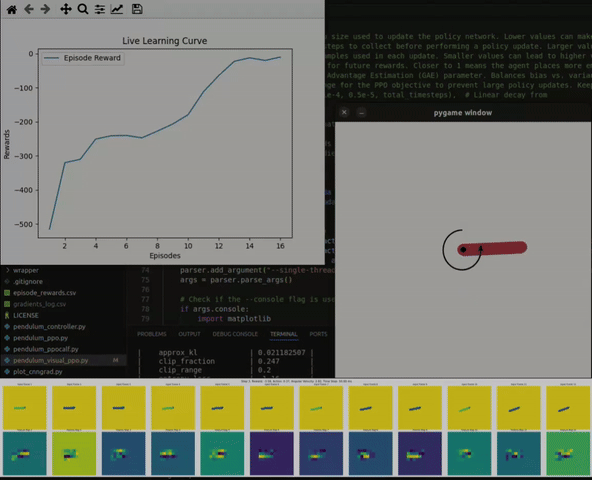

# Stable Baselines Playground with CALF and Visual PPO



This repository is a playground for reinforcement learning using [stable-baselines3](https://github.com/DLR-RM/stable-baselines3).
It extends classic environments like Gym's Pendulum with visual observations.

## Overview

### Visual PPO with CNNs
This repository also includes an extension of PPO (Proximal Policy Optimization) to visual environments. It leverages custom Convolutional Neural Networks (CNNs) to process image-based observations and enables effective policy learning with stacked frames.

### CALF (Critic as Lyapunov Function)
CALF provides a method to stabilize reinforcement learning using Lyapunov theory. For more details, refer to [this paper](https://arxiv.org/abs/2405.18118).

This feature is in development for this repository.

---

## Setting Up the Environment

To work with this repository, it is recommended to use a virtual environment. Refer to the instructions in the [regelum-playground](https://github.com/osinenkop/regelum-playground) for detailed steps.

Make sure to install the required dependencies, including `tkinter` for visualizations:

```bash
pip install -e .
```

Some issues you may find their solution [here](docs/error_resolution.md).

## Repo structure

For a detailed understanding of the repository organization, please refer to the README.md files in each of the following directories: 

- [`src/`](./src) - contains the source code for the project
- [`run/`](./run) - contains the scripts for training and evaluating the agents
- [`snippets/`](./snippets) - contains ambigous scripts for the project
- [`analysis/`](./analysis) - contains the scripts for analyzing the results
- [`docs/`](./docs) - contains the arbitrary documentation for the project
- [`gfx/`](./gfx) - contains the images for the README

## Getting Started

Go to the [`run/`](./run) directory and refer to the README.md files in each of the subdirectories to get more information about the agents and their training and evaluation.
## Author

Pavel Osinenko, 2024

