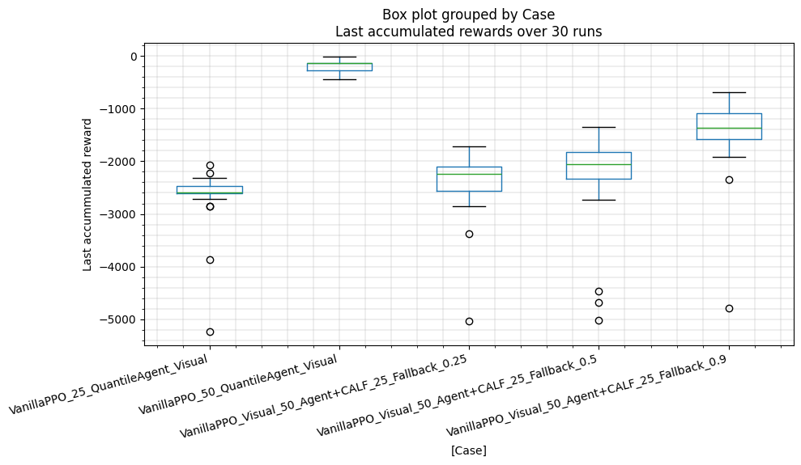

# Visual PPO with CALFWrapper evaluation

> [!IMPORTANT]  
> It's supposed that this subfolder is your working directory: 
> do not forget to apply in your terminal `cd run/ppo_pendulum_calf_wrapper_eval`

## Idea
We want to train a PPO agent on the standard pendulum environment and its observation is a stack of RGB images. Afterwards, we evaluate it with the CALFWrapper on Pendulum environment.
The `PPO agent` is a arbitrary checkpoint which is not trained well.
And actions of `CALF fallback` is sampled from another trained PPO which has to under-trained comparing to the current Agent.

For example:
- `PPO agent` is a checkpoint at the step 20th.
- `CALF fallback` is a checkpoint at the step 15th.

## Aim
To investigate if CALF can boost the performance of posterior checkpoints by using anterior checkpoints as a CALF fallback.

Here we trained and used checkpoints as below:
- `PPO agent` is a checkpoint at the step `655360` which is at the position of **50%** of the total step number.
- `CALF fallback` is a checkpoint at the step `327680` which is at the position of **25%** of the total step number.

### Train PPO and Evaluate PPO (Pendulum Environment) with CALF Wrapper

### CALF Wrapper
CALF Wrapper used for this experiment is modified, due to:
- using vectorized environments like VecStackFrame and VecTranspose.
- using under-trained checkpoints
- needing more CALF activation caused by fired relax probability

`CALFWrapper_CustomizedRelaxProb` use `RelaxProb` whose relax_prob decays linearly and reachs 0 at the end of the evaluation process. 

### Train visual PPO and Evaluate visual PPO (Pendulum Environment) with CALF Wrapper
#### Training
Now ppo trained with nomalized rewards and observation is utilized for this experiment:

```bash
python pendulum_visual_ppo.py --normalize
```

##### Checkpoints

The checkpoints have following formats:
```
run/ppo_vispendulum_self_boost/
# Checkpoints stored each 8192 steps
./artifacts/checkpoints/ppo_visual_pendulum_<step-number>_steps.zip

# The best checkpoint after training
./artifacts/checkpoints/ppo_visual_pendulum_8192_steps.zip 

# Normalized information 
./artifacts/checkpoints/vecnormalize_stats.pkl 
```

##### Configurations

The following configuration was used:

```
total_timesteps = 131072 * 10
episode_timesteps = 1024
image_height = 64
image_width = 64
save_model_every_steps = 8192 / 4
n_steps = 1024
parallel_envs = 4

ppo_hyperparams = {
        "learning_rate": 4e-4,
        "n_steps": n_steps, 
        "batch_size": 512, 
        "gamma": 0.98,
        "gae_lambda": 0.9,
        "clip_range": 0.01,
        "use_sde": True,
        "sde_sample_freq": 16,
    }
```

#### Evaluation
NOTICE: `--fallback-checkpoint` and `--eval-checkpoint` have to be defined in this step.

After training, to evaluate a visual PPO agent on the normal pendulum environment:

```shell
python pendulum_visual_ppo.py --notrain \
    --eval-checkpoint "./artifacts/checkpoints/ppo_visual_pendulum_655360_steps.zip" \
    --eval-name "agent_50" \
    --log --console --seed $i
```

Using the same training checkpoint, to evaluate a visual PPO agent on the pendulum environment + CALF Wrapper:

```shell
python pendulum_visual_ppo_eval_calf_wrapper.py \
    --calf-init-relax 0.5 \
    --calf-decay-rate 0.01 \
    --fallback-checkpoint "./artifacts/checkpoints/ppo_visual_pendulum_327680_steps.zip" \
    --eval-checkpoint "./artifacts/checkpoints/ppo_visual_pendulum_655360_steps.zip" \
    --log --console --seed 42
```

The following CALF configuration was used as default:
```python
calf_hyperparams = {
    "calf_decay_rate": 0.01,
    "initial_relax_prob": 0.5,
}
```

And CALF relax probability **linearly decays** over time steps.


#### Monitoring

Please have a look at MLFlow UI to explore more information about CALF variable during evaluation steps.
To run mlflow, use this command at the project directory:
```
mlflow ui
```

The name of each experiment is formed by "<lauch_file_name>_<_subfix_>". Where `subfix`, may stand for the experimental version, needs to be changed in the python scripts.

#### Options

Option | Description |
| ----- |  ----- |
| `--seed` | Random seed to initialize initial state of the pendulum |
| `--console` | Run in console-only mode (no graphical outputs) |
| `--log` | Enable logging and printing of simulation data |
| `--calf-init-relax` | Choose initial relax probability |
| `--calf-decay-rate` | Choose desired CALF decay rate |
| `--fallback-checkpoint` | Choose checkpoint to load for CALF fallback |
| `--eval-checkpoint` | Choose checkpoint to load for base agent in evaluation |
| `--eval-name` | Choose experimental logging name which will be stored in the "logs| folder |

Or to run 30 seeds with corresponding initial states, varying initial relax probabilities:
```
source evaluation_visual_loop.sh
```

##### Logs
If `--log` option is enable, the logging files are stored in the "logs" folder. Their names are combined by "<prefix>_<subfix>_seed_{seed_number}.csv".
Where:
- prefix: determined inside each launch file.
- subfix: determined by user using `--eval-name` option.
- seed_number: a random seed for initial condition.

#### Results
All the results are calculated using the [Jupyter Notebook](../../analysis/ppo_vispendulum_self_boost/visual_analysis.ipynb) 

| Case                                             |   ('last_accumulated_reward', 'std') |   ('last_accumulated_reward', 'var') |   ('last_accumulated_reward', 'min') |   ('last_accumulated_reward', 'mean') |   ('last_accumulated_reward', 'median') |   ('last_accumulated_reward', 'max') |
|:-------------------------------------------------|-------------------------------------:|-------------------------------------:|-------------------------------------:|--------------------------------------:|----------------------------------------:|-------------------------------------:|
| VanillaPPO_25_QuantileAgent_Visual               |                              571.752 |                             326900   |                            -5238.11  |                             -2657.07  |                               -2588.13  |                           -2076.04   |
| VanillaPPO_50_QuantileAgent_Visual               |                              126.733 |                              16061.3 |                             -438.574 |                              -185.253 |                                -136.996 |                             -11.8081 |
| VanillaPPO_Visual_50_Agent+CALF_25_Fallback_0.25 |                              604.743 |                             365714   |                            -5032.39  |                             -2397.21  |                               -2239.08  |                           -1712.15   |
| VanillaPPO_Visual_50_Agent+CALF_25_Fallback_0.5  |                              870.613 |                             757968   |                            -5028.6   |                             -2304.5   |                               -2055.79  |                           -1345.2    |
| VanillaPPO_Visual_50_Agent+CALF_25_Fallback_0.9  |                              711.288 |                             505930   |                            -4783.17  |                             -1487.83  |                               -1355.4   |                            -679.703  |



